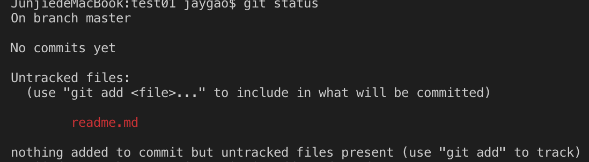
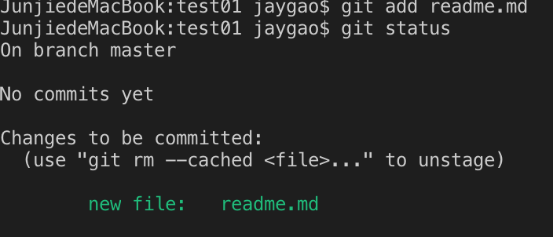
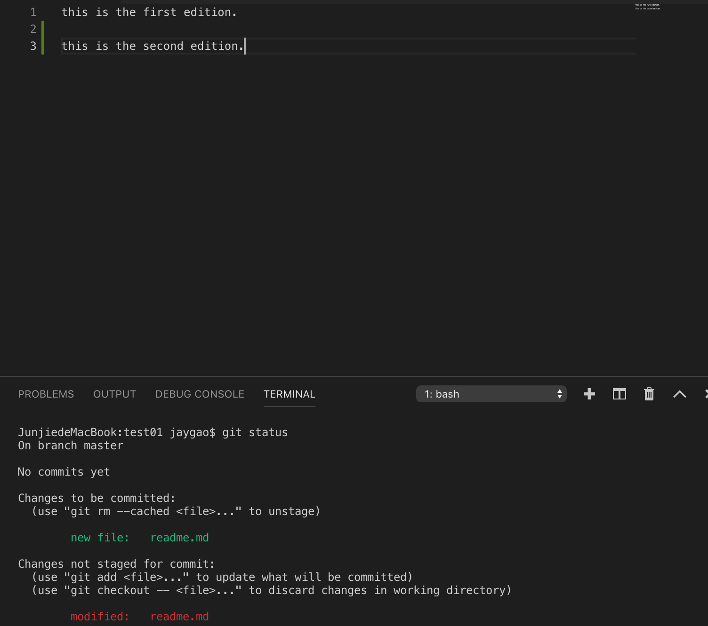
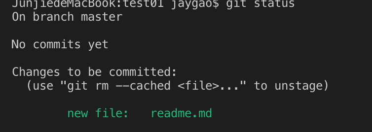
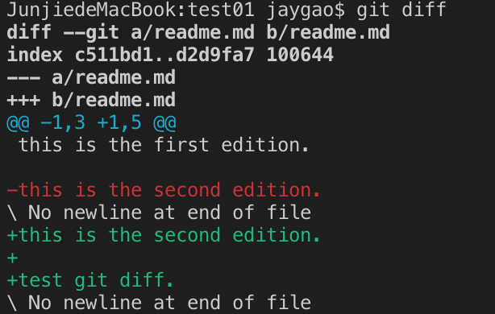
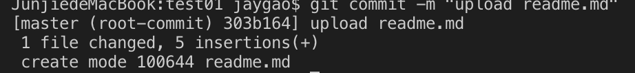

Recording changes to the repository.
===

Each file in the working directory can be in one of two status: ___tracked___ or ___untracked___. Tracked files are files that were in the last snapshot. they can be unmodified, modified, or staged. Tracked files are files that Git knows about.

The lifecycle of the status of files
 

___
## Checking status of files

`$ git status`  
check the status of files. and the which branch you are.

>

## Tracking new files.
`$ git add <file>`  
add file into the git. (tracked)

>

## Staging Modified files.
now change a file that already tracked. then check status:
>

It means this file has been modified in the working directory but not yet staged.

`$ git add <file>` to stage file.
>

&starf; short status:  
    `$ git status -s`
>  \>JunjiedeMacBook:test01 jaygao$ git status -s  
\>A  readme.md

"A" -> new file nas been added to the staging area.
"??" -> new file that aren't tracked.
"M" -> Modified file.

## ignore files

create .gitignore file and list patterns.

`$ cat .ignore`  
`*.[oa] // ignore any files ending in ".o" or ".a"`  
`*~  // ignore all files whose names end with a tilde (~), which is used by many text editors such as Emacs to mark temporary files. `  

## viewing staged and unstaged changes

`$ git diff`  
To see what you’ve changed but not yet staged.

>

`$ git diff --staged`  
To see what you’ve staged that will go into your next commit.

## committing changes

`$ git commit`  
Commit staged changes.

`$ git commit -m <comment>`  
commit with comment.

>

// commit to 'master' branch.

`$ git commit -a -m <comment>`  
Skipping staging area and stage all files that already tracked. 

## Removing files

`$ git rm <file>`  
Then commit, the file would no longer tracked.

## moving files
// can be used to rename file.
`$ git mv <file_from> <file_to>`  
