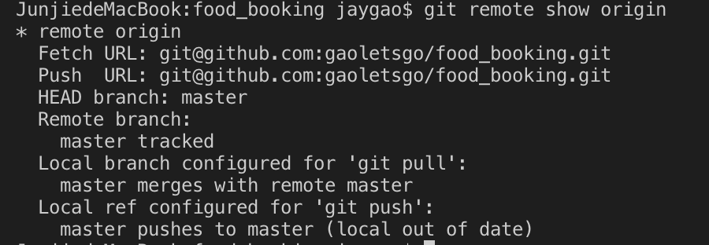

working with remote
===

`$ git remote`  
show which remote servers you have configured. List the shortnames of each remote handle. default name is **origin**.

`$ git  remote -v`  
show the URLs that git has stored for the shortname to be used when reading and writing to that remote.

`git remote add <shortname> <URL>`  
Adding remote repository.

`$ git fetch <remote>`  
fetching and pulling from the remote.

`$ git push <remote> <branch>`  
push your \<branch> to \<remote> server.

## Inspecting a remote

`$ git remote show <remote>`  
see more information about a particular remote.

>

tell you that if you are on the master branch and run `$ git pull`, it will automatocally merge in the __master__ branch.

## rename and remove remotes

`$ git remote rename <old name> <new name>`   

rename a remote. 

`$ git remtoe remove <branch>`  
delete the remote

`$ git clone -b <branch> <remote_repo>`  
clone a specific branch.
