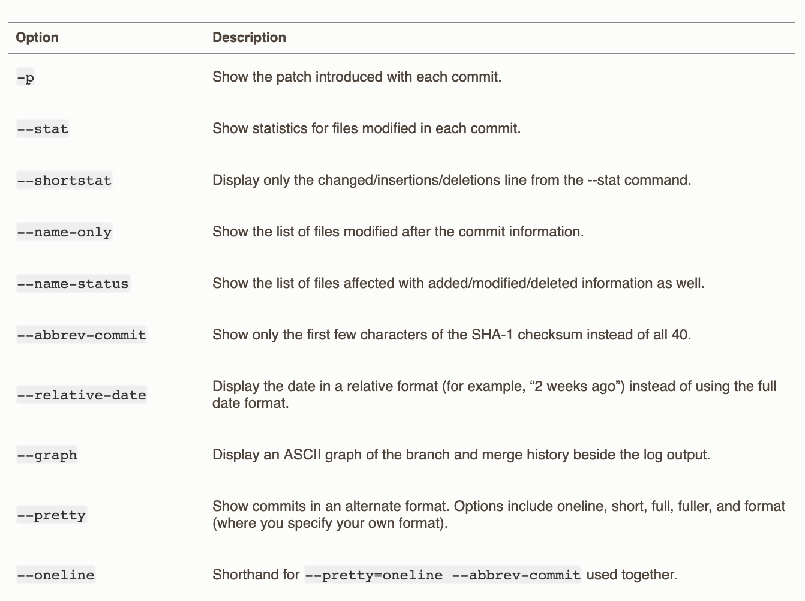

Viewing commit history
===

`$ git log`  
List the commits made in this repository. 

`$ git log -p -2`  
"-p" -> --patch: shows the difference (the patch output) introduced in each commit.
"-2" -> show only the last 2 entries.  

`$ git log --stat`  
 prints below each commit entry a list of modified files, how many files were changed, and how many lines in those files were added and removed. It also puts a summary of the information at the end.

 `$ git log --pretty=oneline`  

 ### git log [option] 

 

 ## From: [Reference](https://git-scm.com/book/en/v2/Git-Basics-Viewing-the-Commit-History)
