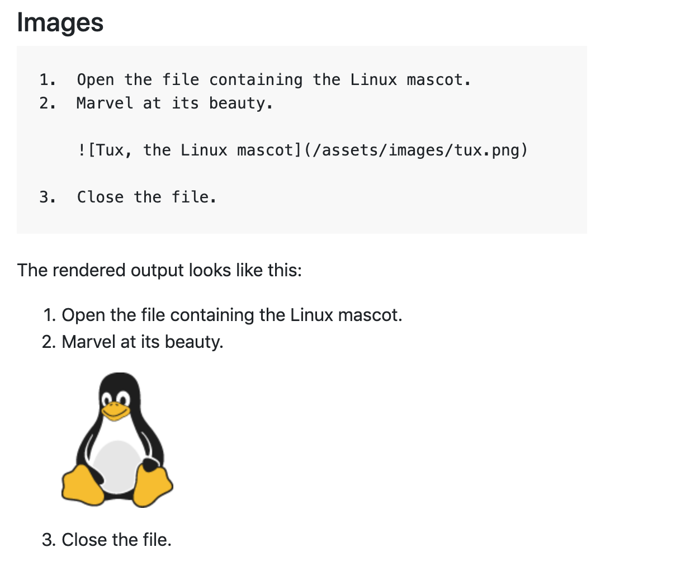

# heading level 1
## heading level 2
### hading level 3
4,5,6 same. <br>

**bold**  
__strong__ 

*italic* <br>_italic_

>quotes

>quote multiple paragrapoh
> # head
>> sub-quote

1. first item
   1. secondary
2. second item

- unordered list
  - sub
- second
  - > quot
  

code: 
<!-- indent 8 spaces / 2 tabs -->
        <html>
            <title>code</title>
        </html>
  
___
<a id="images">images:</a>


___
code:
---
highlight code:

<h4>javascript:</h4>

```javascript
var s = "JavaScript syntax highlighting";
alert(s);
```
#### python:
```python
s = "Python syntax highlighting"
print s
```


___
links:
---
[links to image](#images)


From: [references](https://www.markdownguide.org/basic-syntax/) and [reference](https://github.com/adam-p/markdown-here/wiki/Markdown-Cheatsheet)